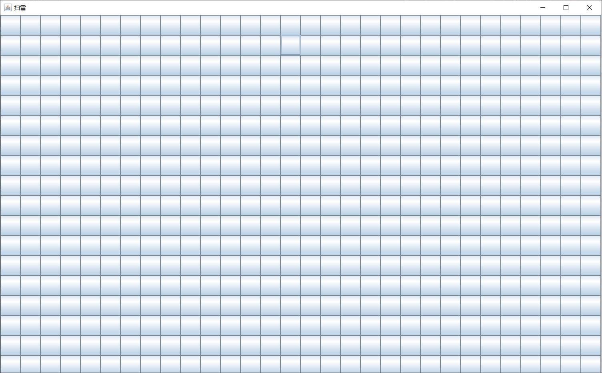
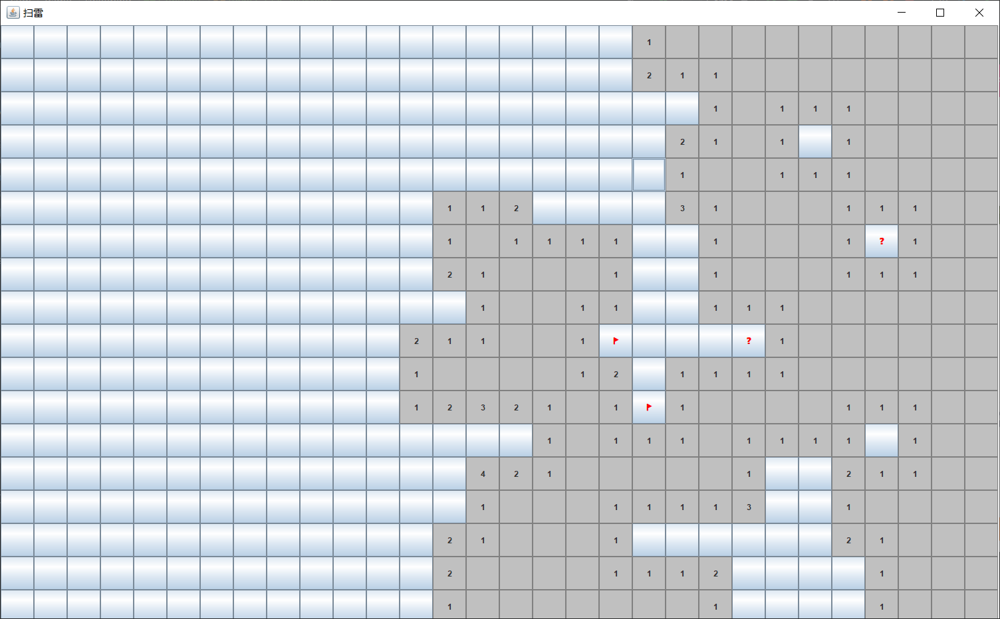
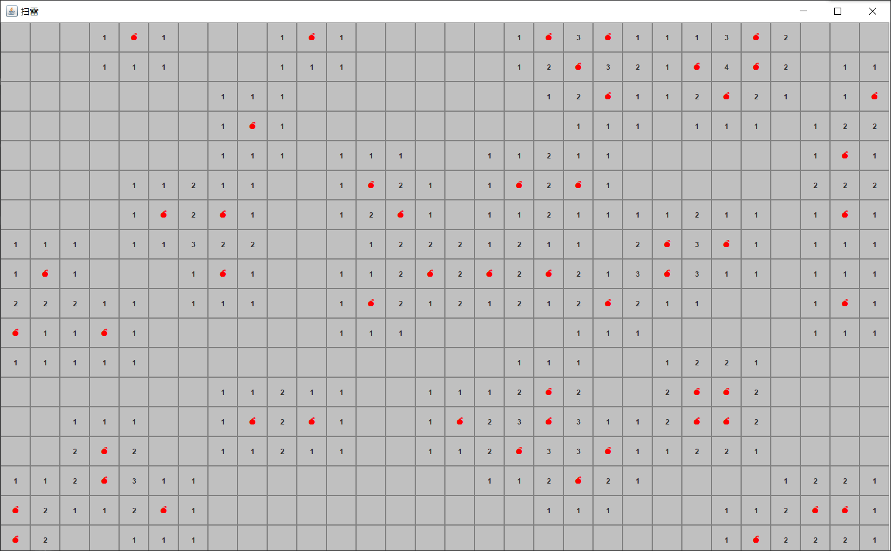
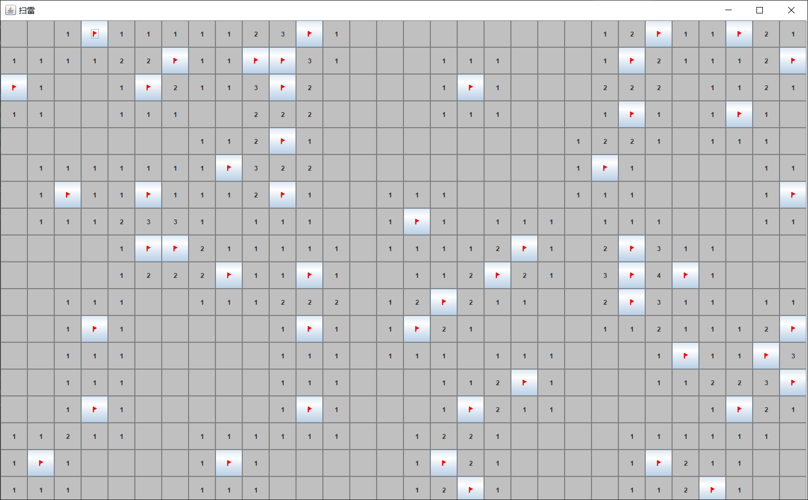

# 扫雷游戏Java简易版

## 开发环境

- IntelliJ IDEA
- JDK 1.8 (Swing)
- UTF-8 编码

## 操作说明

基本扫雷玩法：
- 左键用于打开安全的格子，推进游戏进度
- 右键用于标记地雷，以辅助判断，或为接下来的双击做准备；双击在一个数字周围的地雷标记完时，相当于对数字周围未打开的方块均进行一次左键单击操作。
- 左键单击：在判断出不是雷的方块上按下左键，可以打开该方块。 
    - 如果方块上出现数字，则该数字表示其周围3×3区域中的地雷数（一般为8个格子，对于边块为5个格子，对于角块为3个格子，扫雷中最大的数字为8）。
    - 如果方块上为空（相当于0），则可以递归地打开与空相邻的方块；如果不幸触雷，则游戏结束。
- 右键单击：在判断为地雷的方块上按下右键，可以标记地雷（显示为小红旗）。
    - 重复一次或两次操作可取消标记（如果在游戏菜单中勾选了“标记(?)”，则需要两次操作来取消标雷）。
- 双击：同时按下左键和右键完成双击。当双击位置周围已标记雷数等于该位置数字时操作有效，相当于对该数字周围未打开的方块均进行一次左键单击操作。地雷未标记完全时使用双击无效。若数字周围有标错的地雷，则游戏结束，标错的地雷上会显示一个“×”。

## 游戏过程UI截图

### 初始化界面

### 在空格子上右键单击显示🚩

### 在🚩上右键单击显示❓

### 左键触雷失败💣

### 开完整张图获得胜利👑

## TODO

- 游戏的地雷计数
- 游戏通关后的恭喜效果
- 游戏通关或爆雷后的检查
- 游戏的左右键组合击功能
- 游戏的计时功能
- 游戏的排行榜机制
- 游戏的网络联机机制
- 游戏产雷机制优化
- 游戏初次不踩雷优化
- MORE & MORE

## 参考资料

- [Emoji网站](https://emojipedia.org/)
